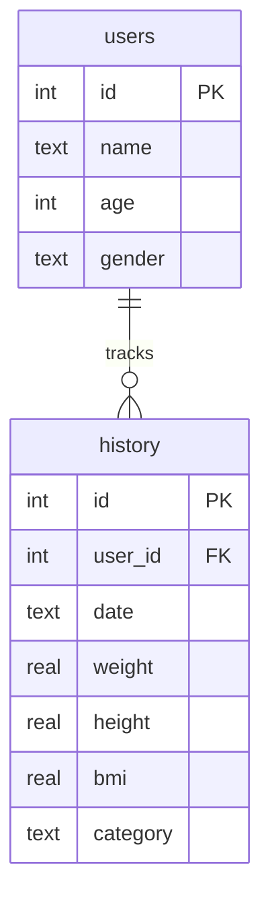

# BMI Calculator & Health Tracker

A modern, highly aesthetic desktop application built with Python and **CustomTkinter**. It allows users to calculate their Body Mass Index (BMI), track historical records across multiple user profiles, view visual trend charts, and toggle between soothing light and dark themes.

All profile and history logs are persistently saved using a local **SQLite database**.

---

## Key Features

- **Interactive BMI Calculator**: 
  - Dynamic live updates as you type or drag sliders.
  - Support for both **Metric** (cm, kg) and **Imperial** (inches, lbs) systems.
  - Real-time gauge visualization highlighting your specific category.
- **Multi-Profile Management**: 
  - Register multiple users with customized age and gender.
  - Switch active profiles instantly via a dropdown or profile management panel.
  - Profile deletion triggers cascading deletes of associated logs.
- **History & Trend Charting**:
  - Detailed list of historical calculations (including easy entry reloading and single-log deletion).
  - A beautiful, theme-aware **Matplotlib** progression line chart highlighting the "Healthy Zone".
- **Visual Design**:
  - Dark mode, light mode, and system theme preferences.
  - Modern typography and color palettes tailored to health classification boundaries.

---

## Tech Stack

- **GUI Framework**: [CustomTkinter](https://github.com/TomSchimansky/CustomTkinter) (v5+)
- **Plotting/Visualization**: [Matplotlib](https://matplotlib.org/) (v3.8+)
- **Database Persistence**: SQLite (Python standard library `sqlite3` module)
- **Programming Language**: Python 3

---

## Database Architecture

The local database file is stored at the root of the project as `bmi_calculator.db`. 

### Schema Diagram



- **Users Table**: Stores user metadata (ID, name, age, and gender).
- **History Table**: Stores normalized metric parameters (`weight` in kg, `height` in cm), calculated BMI score, health category, and the entry log date.
- **Cascade Deletion**: Configured with `ON DELETE CASCADE`, ensuring that deleting a user profile automatically purges their historical logs.

---

## Getting Started

### Prerequisites

Ensure you have Python 3.8+ installed on your system.

### Installation

1. Clone or download this repository.
2. Open your terminal in the project directory.
3. Set up a virtual environment and install the required dependencies:
   ```bash
   # Create a virtual environment
   python -m venv venv

   # Activate the virtual environment
   # Windows (Command Prompt)
   venv\Scripts\activate.bat
   # Windows (PowerShell)
   .\venv\Scripts\Activate.ps1
   # macOS/Linux
   source venv/bin/activate

   # Install requirements
   pip install -r requirements.txt
   ```

### Running the Application

To start the graphical interface, run the following command from the project root:

```bash
python main.py
```

The database `bmi_calculator.db` will be automatically initialized and seeded with default profiles on the first run.
